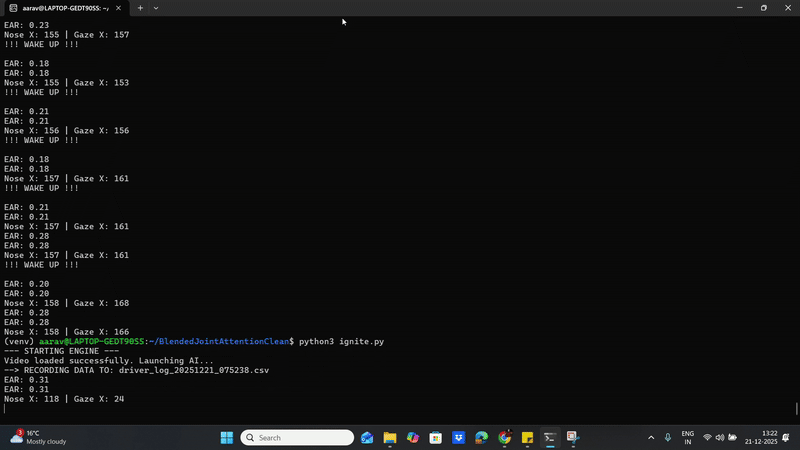

# Driver Drowsiness AI 🚗💤

[](https://github.com/dramer-B/Driver-Drowsiness-AI/actions/workflows/ci.yml)
[](https://opensource.org/licenses/MIT)
[](https://www.python.org/downloads/)
[](http://makeapullrequest.com)

---
<br/>
<div align="center">
  
</div>
<br/>

# 🚗 Driver Drowsiness Detector (AI-Based)


https://github.com/user-attachments/assets/ef9cbc84-4282-4cc7-b7e6-d00ef02e866d


A real-time Computer Vision system that detects driver fatigue using **Eye Aspect Ratio (EAR)** and **Head Pose Estimation**.
Built as a reproduction and modernization of the **Red Hen Lab GSoC 2016** Audio-Visual module.

## 🎯 Features
* **Real-time Eye Tracking:** Uses dlib's 68-point facial landmark predictor.
* **Blink Detection:** Calculates Eye Aspect Ratio (EAR) to detect prolonged eye closure.
* **Head Pose Estimation:** Tracks face orientation (yaw/pitch/roll) using PNP algorithms.
* **Dual Alarm System:**
    * **Visual:** "WAKE UP!" warning overlay.
    * **Audio:** System beep alert for immediate driver correction.

## 🛠️ Tech Stack
* **Language:** Python 3.x
* **Vision:** OpenCV (`cv2`), Dlib
* **Math:** NumPy, SciPy

## 🚀 How to Run
1.  **Clone the repository:**
    ```bash
    git clone [https://github.com/dramer-B/Driver-Drowsiness-AI.git](https://github.com/dramer-B/Driver-Drowsiness-AI.git)
    cd Driver-Drowsiness-AI
    ```

2.  **Install dependencies:**
    ```bash
    pip install opencv-python numpy scipy dlib
    ```

3.  **Run the Engine:**
    * **For Webcam:**
        ```bash
        python3 ignite.py
        ```
    * **For Video File:**
        Edit `ignite.py` to point to your `.mp4` file.

## 📊 The Logic (EAR)
The system uses the Eye Aspect Ratio formula derived from Soukupová and Čech (2016):
> EAR = (||p2 - p6|| + ||p3 - p5||) / (2 * ||p1 - p4||)

If the EAR falls below **0.25** for a set duration, the alarm triggers.
